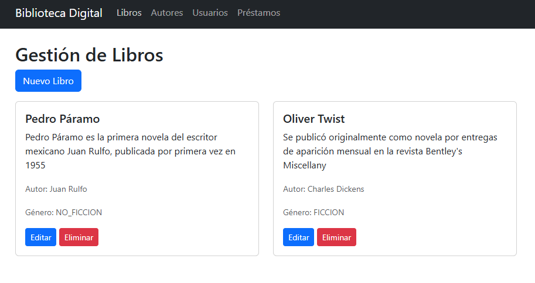
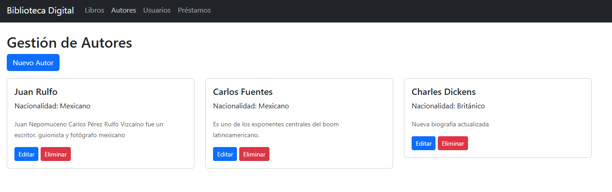
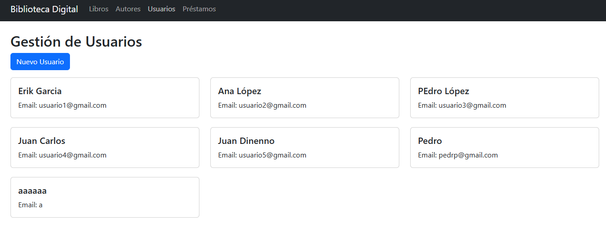
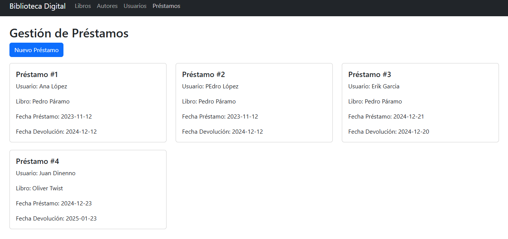
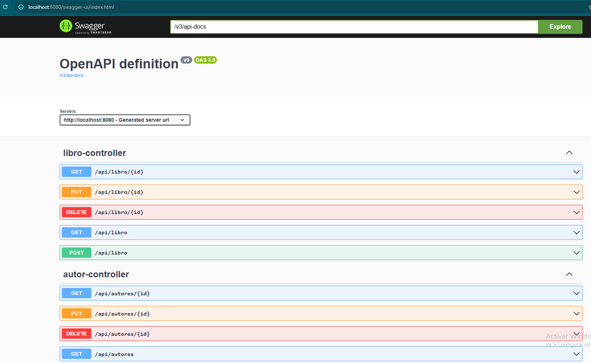

# Library Management System

A web application for managing library resources, including books, authors, users, and loan records. The backend is built with Spring Boot, while the frontend uses HTML, CSS, and JavaScript to provide a responsive user interface.

---

## Features
- **Books**: 
  - Add, update, delete, and search for books.
- **Authors**: 
  - Manage author information (create, update, delete).
- **Users**:
  - Register new users.
  - View user details.
- **Loans**:
  - Record book loans for users.
  - View loan history by user.

---

## Technologies Used
### Backend
- **Spring Boot**: API development.
- **MySQL**: Database for persistent storage.
- **Swagger**: API documentation.

### Frontend
- **HTML5 & CSS3**: Markup and styling.
- **JavaScript**: Dynamic and interactive functionality.

---

## Endpoints
### Books
- `GET /libros`: List all books.
- `GET /libros/{id}`: Retrieve details of a specific book.
- `POST /libros`: Add a new book.
- `PUT /libros/{id}`: Update an existing book.
- `DELETE /libros/{id}`: Remove a book.

### Authors
- `GET /autores`: List all authors.
- `GET /autores/{id}`: Retrieve details of a specific author.
- `POST /autores`: Add a new author.
- `PUT /autores/{id}`: Update an existing author.
- `DELETE /autores/{id}`: Remove an author.

### Users
- `GET /usuarios`: List all users.
- `POST /usuarios`: Register a new user.

### Loans
- `POST /prestamos`: Register a new loan.
- `GET /prestamos/usuario/{id}`: View loan history for a specific user.

---

## Setup Instructions
### Prerequisites
- Java 17 or later.
- MySQL database server.
- A web browser for frontend interaction.

### Steps
1. Clone this repository:
   ```bash
   git clone https://github.com/ErikGarciaLopez/API_BibliotecaDigital.git

---

## Preview






